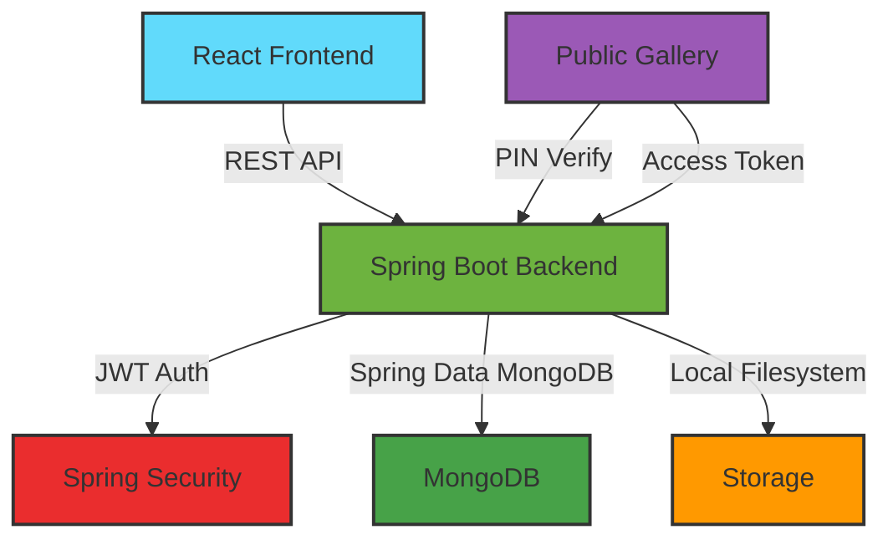
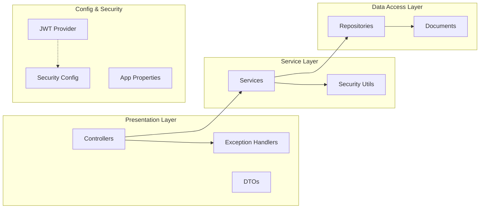

# PhotoShare - Collaborative Event Photography Platform

A production-quality full-stack photo-sharing platform built for collaborative event photography. Designed for photographers, event organizers, and their teams to seamlessly upload, review, select, and publish event photos with secure gallery sharing.

## 📋 Problem Statement

Event photography workflows are often fragmented:
- Photographers upload photos to various cloud services
- Event organizers struggle to review and select photos
- No secure way to share final galleries with clients
- PIN-protected galleries for client access
- Team member access control for specific events

**PhotoShare** solves this by providing a complete end-to-end platform for collaborative event photography.

## ✨ Features

### 🔐 Authentication & Authorization
- JWT-based authentication with access tokens (24h expiry)
- Role-based access control (ADMIN, TEAM_MEMBER)
- Secure password hashing with BCrypt (cost factor 12)
- Centralized exception handling with consistent error responses

### 👨‍💼 Admin Capabilities
- Register/Login as admin
- Create and manage events
- Add/remove team members to events
- View all uploaded photos for their events
- Select/deselect photos for gallery publication
- Create galleries with 6-digit PIN protection
- Publish/unpublish galleries
- Generate shareable gallery URLs
- View event statistics (total photos, selected, published galleries)

### 📸 Team Member Capabilities
- Login and view assigned events
- Upload multiple photos via drag-and-drop (direct multipart upload)
- View upload progress and status
- See only their own uploaded photos
- Cannot create events, manage users, or publish galleries

### 🔒 Public Gallery Access
- No account required for clients
- Secure gallery access via unique public token
- 6-digit PIN verification with rate limiting (5 attempts, 15-min lockout)
- Short-lived access tokens (1 hour)
- Only published, selected photos visible
- Responsive photo grid with lightbox viewer
- No exposure of internal IDs, uploader info, or storage paths

### 🏗️ Technical Features
- **Clean Architecture**: Layered backend (controller → service → repository)
- **Database**: MongoDB with Spring Data MongoDB
- **Storage**: Local filesystem (configurable path, organized by event ID)
- **API**: RESTful with OpenAPI/Swagger documentation
- **Frontend**: React 18 + TypeScript + Vite + Tailwind CSS
- **State Management**: TanStack Query for server state
- **Forms**: React Hook Form + Zod validation
- **Testing**: JUnit 5 + Mockito (backend), Vitest (frontend)

## 🏛️ Architecture



### Backend Architecture (Layered)



### Database Schema (MongoDB Collections)

```mermaid
erDiagram
    USERS ||--o{ EVENTS : creates
    USERS ||--o{ EVENT_MEMBERS : assigned
    USERS ||--o{ PHOTOS : uploads
    EVENTS ||--o{ EVENT_MEMBERS : has
    EVENTS ||--o{ PHOTOS : contains
    EVENTS ||--|| GALLERIES : publishes
    GALLERIES ||--o{ GALLERY_PHOTOS : includes (embedded)
    PHOTOS ||--o{ GALLERY_PHOTOS : selected_in
    GALLERIES ||--o{ PIN_ATTEMPTS : tracks
    GALLERIES ||--o{ GALLERY_ACCESS_TOKENS : issues

    USERS {
        UUID id PK
        STRING name
        STRING email UK
        STRING password_hash
        ENUM role
        BOOLEAN enabled
        TIMESTAMP created_at
        TIMESTAMP updated_at
    }
    
    EVENTS {
        UUID id PK
        STRING name
        TEXT description
        TIMESTAMP event_date
        UUID created_by FK
        TIMESTAMP created_at
        TIMESTAMP updated_at
    }
    
    EVENT_MEMBERS {
        UUID id PK
        UUID event_id FK
        UUID user_id FK
        TIMESTAMP assigned_at
        UNIQUE(event_id, user_id)
    }
    
    PHOTOS {
        UUID id PK
        UUID event_id FK
        UUID uploaded_by FK
        STRING original_filename
        STRING storage_key
        BIGINT file_size
        STRING content_type
        BOOLEAN selected_for_publishing
        TIMESTAMP created_at
    }
    
    GALLERIES {
        UUID id PK
        UUID event_id FK
        STRING public_token UK
        STRING pin_hash
        BOOLEAN published
        TIMESTAMP published_at
        TIMESTAMP created_at
        TIMESTAMP updated_at
        ARRAY photos (embedded)
    }
    
    PIN_ATTEMPTS {
        UUID id PK
        UUID gallery_id FK
        STRING ip_address
        INTEGER attempt_count
        TIMESTAMP locked_until
        TIMESTAMP last_attempt_at
        UNIQUE(gallery_id, ip_address)
    }
    
    GALLERY_ACCESS_TOKENS {
        UUID id PK
        UUID gallery_id FK
        STRING token UK
        STRING ip_address
        TEXT user_agent
        TIMESTAMP expires_at
        TIMESTAMP created_at
    }
```

## 🛠️ Technology Stack

### Backend
- **Java 17** (compatible with 21)
- **Spring Boot 3.2.5**
- Spring Web, Spring Data MongoDB, Spring Security
- Spring Validation, MongoDB Driver
- JWT (jjwt 0.12.6), BCrypt
- MapStruct, Lombok
- SpringDoc OpenAPI 2.5.0
- JUnit 5, Mockito, Testcontainers (MongoDB)

### Frontend
- **React 18.2** with **TypeScript 5.2**
- **Vite 5.1** for fast development
- **Tailwind CSS 3.4** for styling
- **React Router 6.22** for routing
- **TanStack Query 5.17** for server state
- **React Hook Form 7.50** + **Zod 3.22** for forms
- **Axios 1.6** for HTTP
- **Lucide React** for icons
- **React Hot Toast** for notifications
- **React Dropzone** for file uploads

### Infrastructure
- **MongoDB 7** (local)
- Local filesystem storage for photos (configurable path)
- Environment-based configuration
- No Docker, no AWS required for local development

## 🚀 Local Setup

### Prerequisites
- Java 17+ (tested with 17)
- Maven 3.9+
- Node.js 18+
- MongoDB 7+ (running locally on port 27017)

### 1. Clone & Configure
```bash
git clone <repository>
cd full-stack-project

# Copy environment template
cp .env.example .env

# Edit .env with your values
# Required: JWT_SECRET, MongoDB URI
```

### 2. Start MongoDB
Ensure MongoDB is running locally:
```bash
# Windows (if installed as service)
net start MongoDB

# Or start manually
mongod --dbpath <your-data-path>
```

### 3. Run Backend
```bash
cd backend
mvn spring-boot:run
# Runs on http://localhost:8080/api
```

### 4. Run Frontend
```bash
cd frontend
npm install
npm run dev
# Runs on http://localhost:5173
```

## 🌐 API Overview

### Authentication
| Method | Endpoint | Description |
|--------|----------|-------------|
| POST | `/api/auth/register` | Register new admin |
| POST | `/api/auth/login` | Login |
| GET | `/api/auth/me` | Get current user |

### Events (Admin)
| Method | Endpoint | Description |
|--------|----------|-------------|
| POST | `/api/events` | Create event |
| GET | `/api/events` | List my events (paginated) |
| GET | `/api/events/list` | List my events (simple) |
| GET | `/api/events/{id}` | Get event details |

### Event Members (Admin)
| Method | Endpoint | Description |
|--------|----------|-------------|
| POST | `/api/events/{id}/members` | Add team member |
| GET | `/api/events/{id}/members` | List members |
| DELETE | `/api/events/{id}/members/{userId}` | Remove member |

### Photos
| Method | Endpoint | Description |
|--------|----------|-------------|
| POST | `/api/events/{id}/photos` | Upload photo (multipart) |
| GET | `/api/events/{id}/photos` | List event photos (admin, paginated) |
| GET | `/api/events/{id}/photos/mine` | List my photos (team member, paginated) |
| PATCH | `/api/events/{id}/photos/selection` | Select/deselect photos |
| GET | `/api/events/{id}/photos/selected` | Get selected photos |
| GET | `/api/events/{id}/photos/{photoId}/download` | Download photo |

### Galleries (Admin)
| Method | Endpoint | Description |
|--------|----------|-------------|
| POST | `/api/events/{id}/gallery` | Create gallery with PIN |
| GET | `/api/events/{id}/gallery` | Get gallery details |
| POST | `/api/events/{id}/gallery/publish` | Publish gallery |
| POST | `/api/events/{id}/gallery/unpublish` | Unpublish gallery |

### Public Gallery
| Method | Endpoint | Description |
|--------|----------|-------------|
| GET | `/api/public/galleries/{token}` | Get gallery info |
| POST | `/api/public/galleries/{token}/verify` | Verify PIN, get access token |
| GET | `/api/public/galleries/{token}/photos` | Get gallery photos (requires access token) |
| GET | `/api/public/galleries/{token}/photos/{photoId}` | Get photo file (requires access token) |

## 🔐 Security Checklist

- ✅ Passwords hashed with BCrypt (cost 12)
- ✅ JWT authentication with expiration (24h)
- ✅ Role-based authorization enforced server-side
- ✅ Event ownership/membership verified on every request
- ✅ Team members cannot access other users' events
- ✅ Team members cannot create events or publish galleries
- ✅ Photos stored on local filesystem, only metadata in MongoDB
- ✅ Gallery PIN hashed with BCrypt (never stored in plaintext)
- ✅ Public token is cryptographically secure (Base64 URL-safe, 32 bytes)
- ✅ Unpublished galleries inaccessible via public API
- ✅ Unselected photos never exposed publicly
- ✅ Input validation on all endpoints (Jakarta Validation)
- ✅ CORS configured for frontend origin
- ✅ Error responses don't expose stack traces
- ✅ Secrets via environment variables
- ✅ `.env` in `.gitignore`
- ✅ PIN brute-force protection (5 attempts, 15-min lockout)
- ✅ Short-lived gallery access tokens (1 hour)
- ✅ PIN never sent back to frontend
- ✅ PIN never stored in localStorage
- ✅ Path traversal protection in file storage
- ✅ File type and size validation

## 🧪 Testing

### Backend Tests
```bash
cd backend
mvn test
```
Tests cover:
- Registration & login
- Invalid credentials handling
- Admin authorization
- Team member authorization
- Cross-event access prevention
- Photo upload & selection
- Gallery creation & publishing
- PIN verification (correct/incorrect)
- Unpublished gallery access rejection
- Public gallery photo filtering

### Frontend Tests
```bash
cd frontend
npm test
```

## 🚀 Deployment

### Backend (Render / Railway / AWS / VPS)
1. Build: `mvn clean package -DskipTests`
2. Set environment variables in platform
3. Use `java -jar target/photoshare-backend-1.0.0.jar`
4. Ensure MongoDB accessible
5. Configure PHOTO_STORAGE_PATH for persistent storage

### Frontend (Vercel / Netlify / Static hosting)
1. Build: `npm run build`
2. Deploy `dist/` folder
3. Set `VITE_API_URL` to backend URL
4. Configure CORS on backend

### Database
- Use managed MongoDB (MongoDB Atlas, AWS DocumentDB, etc.) or self-hosted
- Spring Data MongoDB auto-creates indexes on startup

### File Storage
- Local filesystem (configure PHOTO_STORAGE_PATH)
- Ensure backup strategy for uploaded photos

## ⚠️ Known Limitations

1. **No email notifications** - Team member invites don't send emails
2. **No image processing** - Thumbnails/optimization not implemented
3. **Single gallery per event** - Only one gallery allowed per event
4. **No gallery expiration** - Galleries don't auto-expire
5. **No batch operations** - Bulk delete/download not implemented
6. **File type validation** - Only basic MIME type checking
7. **No audit logging** - Admin actions not logged
8. **Local storage only** - No cloud storage option in current implementation

## 📁 Project Structure

```
/
├── backend/
│   ├── src/main/java/com/photoshare/
│   │   ├── config/          # Security, OpenAPI, App Properties
│   │   ├── controller/      # REST Controllers
│   │   ├── dto/             # Data Transfer Objects
│   │   ├── entity/          # MongoDB Documents
│   │   ├── exception/       # Custom Exceptions & Handlers
│   │   ├── repository/      # Spring Data MongoDB Repositories
│   │   ├── security/        # JWT, Filters, Auth
│   │   ├── service/         # Business Logic
│   │   ├── storage/         # Local Filesystem Storage
│   │   └── util/            # Security Utilities
│   ├── src/main/resources/
│   │   └── application.yml  # Configuration
│   ├── src/test/            # Unit & Integration Tests
│   ├── pom.xml              # Maven Configuration
│   └── Dockerfile           # Backend Container (optional)
├── frontend/
│   ├── src/
│   │   ├── api/             # Axios instance & endpoints
│   │   ├── components/      # Reusable UI Components
│   │   ├── context/         # React Context (Auth)
│   │   ├── hooks/           # Custom React Hooks
│   │   ├── layouts/         # Page Layouts
│   │   ├── pages/           # Page Components
│   │   │   ├── admin/       # Admin Pages
│   │   │   ├── team/        # Team Member Pages
│   │   │   └── public/      # Public Gallery Pages
│   │   ├── routes/          # Routing Configuration
│   │   ├── services/        # Frontend Services
│   │   ├── types/           # TypeScript Types
│   │   └── utils/           # Helper Functions
│   ├── package.json
│   ├── tsconfig.json
│   ├── vite.config.ts
│   ├── tailwind.config.js
│   ├── postcss.config.js
│   └── Dockerfile           # Frontend Container (optional)
├── .env.example             # Environment Template
├── .gitignore
└── README.md
```

## 🔑 Demo Credentials

After starting the application, you can create demo accounts:

**Admin**
- Email: `admin@demo.com`
- Password: Set during registration (min 8 chars)

**Team Member**
- Email: `member@demo.com`
- Password: Set during registration (min 8 chars)

Create an event as admin, add the team member, then test the full workflow.

## 🎬 Demo Gallery Flow

1. **Admin** creates event "Arjun & Priya Wedding"
2. **Admin** adds team member `member@demo.com`
3. **Team Member** logs in, sees assigned event
4. **Team Member** uploads 10 photos via drag-and-drop
5. **Admin** reviews all 10 photos, selects 3 for gallery
6. **Admin** creates gallery with PIN `482917`
7. **Admin** publishes gallery, gets shareable URL
8. **Customer** opens URL, sees PIN screen
9. **Customer** enters wrong PIN → Access denied
10. **Customer** enters correct PIN → Views 3 selected photos

## 📝 License

MIT License - see LICENSE file for details

## 🤝 Contributing

1. Fork the repository
2. Create feature branch
3. Commit changes
4. Push to branch
5. Open Pull Request

## 📞 Support

For issues and questions, please open a GitHub issue.